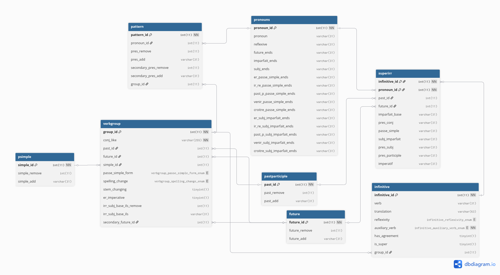

# Hash Conj

Here will be provided most of the documentation for the hashconj.com website.
The project is organized into `vue-fr` and `server` to separate the frontend
and backend respectively. The frontend is primarily written in `vue.js` while
the backend uses `express.js` and `mysql`.


## Overview:

### What is a conjugation?

Put simply, a conjugation is the way a verb changes its form to show who is doing the action, when it happens, or how it happens.

Examples: *I run. She runs. We were running*

French has a similar system of conjugation. The french equivalents of the above conjugations would be:<br>

*Je cours. Elle court. Nous courions.*

The <a href="https://hashconj.com">Hashconj</a> website supports 18 of these conjugation forms for most verbs.

### How does this work?

Before diving into the schema and the implementation, I want to first explain at a high-level how these conjugations are being made.

For all mostly regular conjugations that follow a specific pattern, I start with the infinitive, or the base verb. In English this would be something like to run or to eat. In french this is always a single word. For example, 'to run' is 'courir' and 'to eat' is 'manger'. From this infinitive, I remove and add letters to the end to form all the conjugations. Some conjugation forms also require me to add a specific form of an auxiliary verb before the verb. For example, 'He ate' would be 'Il ***a*** mangé'. What I am typically storing for each pattern is the amount of letters I need to remove from the end of the word and what letters I need to add back. A stored procedure handles everything else.

Using this system makes it very easy to add new verbs. All I have to do is write the infinitive form of the verb, it's English translation, a few verb specific attributes and it's pattern group and it's ready to conjugate.

For verbs that don't follow a specific pattern at all (like the two most common verbs), there is a **super irregular** table that stores the more verbose conjugations.

### The Schema

Here is the schema for how I'm storing conjugation data in the database:



Without going too in depth, I'll try to explain how everything works together.

The starting point of this schema would be the `infinitive` table. It stores the actual verb, the translation and other verb specific information. It also stores a `group_id` *(except in the case of very irregular verbs)* which is a foreign key referencing the primary key of the `verbgroup` table.

The `verbgroup` table stores all the unique patterns for all the verbs with mostly regular conjugations. By patterns I mean the number of letters to remove and what letters to add. 

The `psimple`, `pastparticiple` and `future` tables are essentially tables to simplify the `verbgroup` table and prevent unnecessary redundancy by putting the number of characters to remove and what characters to add inside of tables for those specific tenses and simply adding a reference to one of those tables inside of `verbgroup`. These three tenses also have a very standard ending pattern. For example, the 'futur simple' always has the same ending for every verb (eg. -ai for first-person singular, -as for second-person singular, ...). So what is being stored is only how to arrive at the base form of that conjugation. This consistency of the ending is not the case for the present tense though.

The `pattern` table stores all the present tense conjugations. For almost every verb, it stores 6 versions, one for every pronoun, and references the `group_id` of the `verbgroup` table.

The last two tables are the `pronouns` table and the `superirr` table. The `pronouns` table simply stores constants that I don't want to hard-code inside of the stored procedure. It has the pronouns and the endings of all the forms that have consistent endings. Going back to the 'futur simple' example you can see there is a column for 'future_ends' that stores the 'futur simple' ending for each pronoun.

Finally, the `superirr` table stores verbs that would be very difficult to fit into a verb group as it includes verbs that are for the most part unique. It would require making the rest of the code more complicated so I kept these verbs in their own table.

### Examples

Here is an example of how I create a verb group:

```
CALL addPastID(2, 'é', @past_id); 
CALL addFutureID(0, '', @future_id);
CALL addSimpleID(2, '', @simple_id);
SET @passe_simple_form = 'er';

INSERT INTO verbgroup (conj_like, past_id, future_id, simple_id, passe_simple_form)
VALUES ('reg_er', @past_id, @future_id, @simple_id, @passe_simple_form);
SET @group_id = LAST_INSERT_ID();

INSERT INTO pattern (pronoun_id, pres_remove, pres_add, group_id) 
VALUES 
(1, 2, 'e', @group_id),
(2, 2, 'es', @group_id),
(3, 2, 'e', @group_id),
(4, 2, 'ons', @group_id),
(5, 2, 'ez', @group_id),
(6, 2, 'ent', @group_id);
```
Essentially what is happening here is that I am creating the 3 entries into the `psimple`, `pastparticiple` and `future` tables and storing them in variables along with another verb specific attribute. I then insert all this information inside of the verbgroup table along with a name for the group. I then create the pattern for the singular form of the verb.

Here's how I add a verb to this group:

```
SET @reg_er = (SELECT group_id FROM verbgroup WHERE conj_like = 'reg_er');

INSERT INTO infinitive (verb, translation, reflexivity, auxiliary_verb, group_id)
VALUES ('sembler', 'to seem', 'pnr', 'avoir', @reg_er);
```
Since this verb is one of the very regular verbs, it could even be simplified to this:

```
SET @reg_er = (SELECT group_id FROM verbgroup WHERE conj_like = 'reg_er');

INSERT INTO infinitive (verb, translation, group_id)
VALUES ('sembler', 'to seem', @reg_er);
```
This makes it very simple to add new verbs if you know its pattern.

Adding very irregular verbs goes something like this:

```
INSERT INTO infinitive (verb, translation, reflexivity, auxiliary_verb, is_super)
VALUES ('avoir', 'to have', 'anr', 'avoir', 1);
SET @infinitive_id = LAST_INSERT_ID();

CALL addPastID(5, 'eu', @past_id); 
CALL addFutureID(4, 'ur', @future_id);
SET @imparfait_base = 'av';
SET @pres_participle = 'ayant';

INSERT INTO superirr (infinitive_id, pronoun_id, past_id, future_id, imparfait_base, pres_conj, passe_simple, subj_imparfait, pres_subj, pres_participle, imperatif)
VALUES
(@infinitive_id, 1, @past_id, @future_id, @imparfait_base, 'ai', 'eus', 'eusse', 'aie', @pres_participle, null),
(@infinitive_id, 2, @past_id, @future_id, @imparfait_base, 'as', 'eus', 'eusses', 'aies', @pres_participle, 'aie'),
(@infinitive_id, 3, @past_id, @future_id, @imparfait_base, 'a', 'eut', 'eût', 'aie', @pres_participle, null),
(@infinitive_id, 4, @past_id, @future_id, @imparfait_base, 'avons', 'eûmes', 'eussions', 'ayons', @pres_participle, 'ayons'),
(@infinitive_id, 5, @past_id, @future_id, @imparfait_base, 'avez', 'eûtes', 'eussiez', 'ayez', @pres_participle, 'ayez'),
(@infinitive_id, 6, @past_id, @future_id, @imparfait_base, 'ont', 'eurent', 'eussent', 'aient', @pres_participle, null);
```
